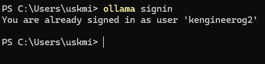
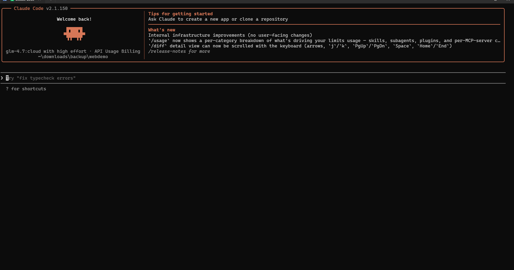
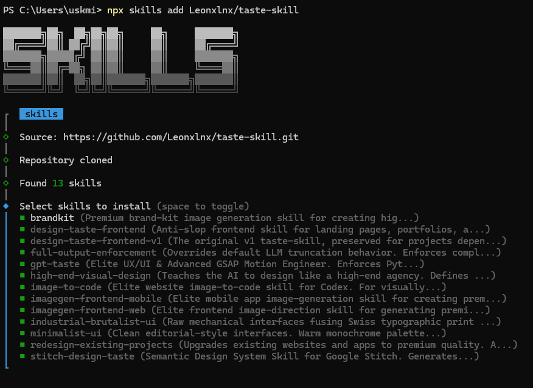
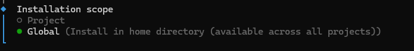
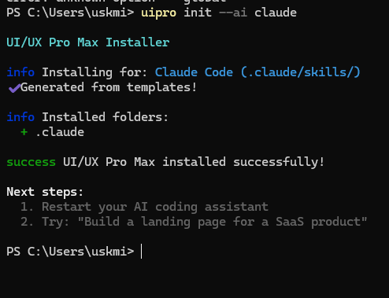
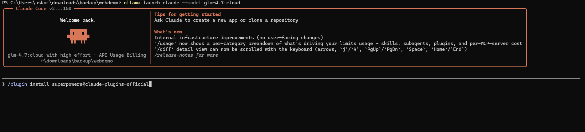
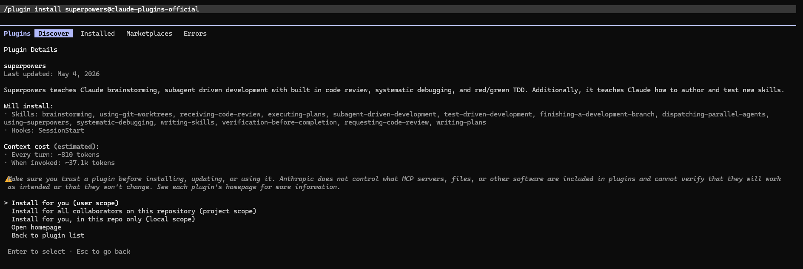
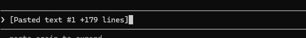
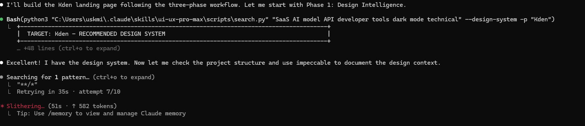

# This is a guide to get up your own website

## Step 1 (setting up your AI coding enviroment (P.S. you can do this or just make the website on claude.ai) )

### Step 1.1 (setting up ollama)
1. go to [ollama.com](https://ollama.com/download)
2. download ollama app for [windows](https://ollama.com/download/OllamaSetup.exe) or [mac](https://ollama.com/download/Ollama.dmg)
3. open the ollama app
4. go to settings:

Then go to Sign in:

After signing in, you should see something like this:

After that, go terminal and type `ollama signin`, sometime it says its already signed in like:

if not, just sign in again, then your set!

then, to test it, go to Powershell in windows or Terminal and type `ollama run glm-4.7:cloud`:

When you run that, you should see this: 

A simple `Hi!` checks if you are actually signed in

---
### Step 1.2 (Installing Claude Code)
1. go to terminal (in mac) and type ` curl -fsSL https://claude.ai/install.sh | bash`, and for Powershell (Windows), type ` irm https://claude.ai/install.ps1 | iex`
---
### Step 1.3 (making the website)
1. Go make a directory, so downloads/my-web-page for example to work on.
2. Then go to your directory, so cd {your path}, so something like `cd downloads/backup/hallo` for example
3. Then, go to terminal and type `ollama launch claude --model glm-4.7:cloud`, if you did eerything correctly, you should see something like this:

Now you can work on your website! 

---
### Step 1.4 (Installing claude skills)
1. first, get the [Taste skill](https://www.tasteskill.dev/), whitch teaches the model what looks like AI generated slop and what is aesthetically pleasing. To download it run `npx skills add Leonxlnx/taste-skill` in your terminal. in your terminal, select all the skills by pressing space and moving down (you need to do this for all of the upcoming skills):

Then make sure that claude Code is selected:

Then press enter and press global:

Then press enter, and select Symlink as the Installation method, and press Proceed with install. (P.S. you need to do this with each and every skill)

2. Next skill Is the [Impeccable skill](https://impeccable.style/#downloads) that teaches proper UI animations and proper idea thinking and implamentation skills. Run it by running `npx skills add pbakaus/impeccable` in your terminal (follow the steps above)

3. [install UI/UX pro max skill](https://ui-ux-pro-max-skill.nextlevelbuilder.io/), install it by running `uipro init --ai claude` (this one is a one liner, it should install by itself):

4. Install Superpowers Skill. For this one, go to claude code (so `ollama launch claude --model glm-4.7:cloud` in your project folder), then type `/plugin install superpowers@claude-plugins-official` in there:

and press enter twice, so press install for you:

---
### Step 1.5 (Initializing the skills)
1. before you run anything, you need to "initialize all your skills", so first run `/impeccable`, press enter (in claude code BTW), and then `/ui-ux-pro-max`, and then finally `/using-superpowers` (run these one at a time). Now you are ready for Step 2! 

---
## step 2 (The vibe coding (Also P.S. you can just tell claude to make it anyway) )

1. now, you can tell what you want to make to [claude](https://claude.ai/new), and tell it to make a prompt for claude code, so the prompt for claude will be something like this: `hi claude! I need your help making me a prompt for claude code, I have 3 skills, superpowers, impeccable and ui-ux-pro-max skill. The website must be a HTML page without any react or anything like that since this will go onto github pages. I want to make a website for {website idea}. `
2. Claude will give you a nice polished prompt like (my example): [(The prompt I got from Claude)](assets/example_prompt_from_claude.md)
3. Then you feed that prompt to claude code:

4. If it asks for any tool use, let it cook! just eneble all the tool calls and command line uses it asks for, if theres an error it will fix it itself, something like: 

Then, when you are done, it should give you a simple html file output, like [Example Webpage](assets/example_webpage.html)

With that, you are now done with the Vibe Coding step! now, open the html file (not chrome! in a text editor), and copy it. Then, head onto github.com, and create a new repository for this. After this, click Add file, and then Create new file: 

And call it index.html (required!), then press Commit Changes:

Now, head onto [cloudflare pages](https://pages.cloudflare.com/), then sign up. After that, go onto Compute and then Workers & Pages:

After that, click on Create Application:

After that, press "Looking to deplot Pages? ***Get started!***" thing 

After that, press "Import an existing Git repository"

